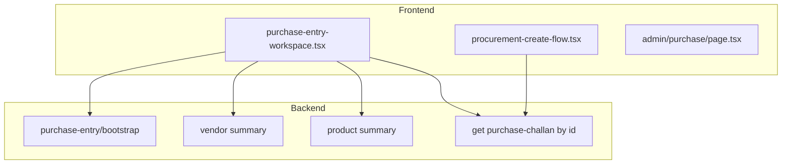

# Purchase module – implementation plan (file-level)

## Architecture snapshot

---

## 1. Type logic (LOCAL vs CENTRAL)

**Rule:** Compare the **first 2 characters** of the **client (company) GSTIN** with the **first 2 characters** of the **vendor GSTIN** (after normalizing to uppercase alphanumerics). Same prefix → **LOCAL**; otherwise → **CENTRAL**. Ignore warehouse-state vs vendor-state for this screen (replace [`deriveTaxType`](apps/frontend/components/modules/purchase-entry-workspace.tsx) and `derivePurchaseTypeFromGstin` usage paths that conflict).

**Backend – [`apps/backend/app/schemas/procurement.py`](apps/backend/app/schemas/procurement.py)**  
- Extend [`PurchaseEntryBootstrap`](apps/backend/app/schemas/procurement.py) with optional `company_gstin: str | None` (or `client_gstin_prefix: str | null` if you prefer only two chars).

**Backend – [`apps/backend/app/api/routers/procurement.py`](apps/backend/app/api/routers/procurement.py)**  
- In `purchase_entry_bootstrap`, load the active company (same pattern as other “default company” reads if one exists; else first `Company` row) and set `company_gstin` from `Company.gstin`.

**Frontend – [`apps/frontend/components/modules/purchase-entry-workspace.tsx`](apps/frontend/components/modules/purchase-entry-workspace.tsx)**  
- In `loadBootstrap`, read `company_gstin` from bootstrap response into state (e.g. `companyGstin`).  
- Add `derivePurchaseTaxType(companyGstin: string | null, vendorGstin: string | null): "LOCAL" | "CENTRAL"` implementing the 2-digit prefix rule; handle missing GSTIN (fallback: **CENTRAL** or last-known behavior—document in code).  
- Replace `setTaxType` when vendor or company GSTIN changes: prefer this over `vendor.purchase_type` and over `deriveTaxType(warehouseState, vendor.state)` for the displayed/saved `tax_type` on bills.  
- Ensure `tax_type` in `saveEntry` payload matches the new logic.

**Optional consistency:** If procurement inline bill or other UIs compute purchase type separately, align them or centralize a small shared helper in [`apps/frontend/lib/`](apps/frontend/lib/) (e.g. `purchase-tax-type.ts`).

---

## 2. “Challan view getting zero” and open challan counts

**Bug A – Line quantities when opening a challan in workspace**  
[`GET /procurement/purchase-challans/{id}`](apps/backend/app/api/routers/procurement.py) returns items with **`quantity`**, not `quantity_1st` / `quantity_2nd`. The load effect in [`purchase-entry-workspace.tsx`](apps/frontend/components/modules/purchase-entry-workspace.tsx) (around the `items.map` block) currently reads `item.quantity_1st` etc., so lines load **empty** → zeros.

- **Fix in `purchase-entry-workspace.tsx`:** For `mode === "challan"` loads, map `item.quantity` into the line model: set primary quantity field (`quantity1`) from `quantity` (and leave 2nd/3rd empty unless API is extended). Recompute or set `amount`/`rate` defaults consistently with existing `lineBaseQuantity` / `computeLineAmount`.

**Bug B – “All open challans” item count**  
In [`procurement-create-flow.tsx`](apps/frontend/components/modules/procurement-create-flow.tsx), `fetchGeneralOpenChallans` uses `challan.item_rows?.length` but the API returns **`items`**.  
- **Fix:** Use `challan.items?.length` or `Array.isArray(challan.items) ? challan.items.length : 0`.

**Dead UI – Challan preview dialog**  
`previewChallan` state is never set (only cleared). Either **wire “View”** to `setPreviewChallan(challan)` for read-only modal **or** remove the dialog if workspace view-only replaces it (see section 4).

---

## 3. Product selector scrolling

**File:** [`apps/frontend/components/modules/purchase-entry-workspace.tsx`](apps/frontend/components/modules/purchase-entry-workspace.tsx) (vendor/product search `Dialog` + list).  
- Wrap the results list in a container with `max-h-[min(60vh,420px)] overflow-y-auto` (and optionally Radix `ScrollArea` from `@/components/ui/scroll-area` if the project uses it).  
- Ensure the focused row / `productIndex` stays visible on keyboard nav (scroll into view on index change).

Mirror the same pattern in product search inside [`procurement-create-flow.tsx`](apps/frontend/components/modules/procurement-create-flow.tsx) if it has a long list.

---

## 4. View-only vs Edit + top-right Edit + confirm

**File:** [`apps/frontend/components/modules/purchase-entry-workspace.tsx`](apps/frontend/components/modules/purchase-entry-workspace.tsx)  
- Add props, e.g. `initialViewOnly?: boolean` and/or derive from `initialId && !userClickedEdit`.  
- When **view-only**: disable inputs, grid edits, save, product add/delete as needed; show **“Edit”** in the header (top right, next to Close).  
- On **Edit** click: `window.confirm("Are you sure you want to edit?")` → on OK, set `viewOnly` false and enable editing (respect `canWritePurchase`: if false, keep read-only and hide Edit).  
- Pass `initialViewOnly={true}` from [`procurement-create-flow.tsx`](apps/frontend/components/modules/procurement-create-flow.tsx) when opening existing challan/bill via **View**; `false` for **Create** / **Edit**.

**File:** [`apps/frontend/components/modules/procurement-create-flow.tsx`](apps/frontend/components/modules/procurement-create-flow.tsx)  
- Change **View** button to open workspace with `initialViewOnly` (new prop) and **Edit** without it (or with `initialViewOnly={false}`).  
- Ensure **View** and **Edit** are not identical (currently both use the same `setEditingId` / `setShowWorkspace`).

---

## 5. Layout: top / middle / last rows, right rail, three cards, shortcuts

**Primary file:** [`apps/frontend/components/modules/purchase-entry-workspace.tsx`](apps/frontend/components/modules/purchase-entry-workspace.tsx)

Restructure JSX (keep existing state/logic; move blocks):

| Region | Content (per your spec) |
|--------|-------------------------|
| **Top row** | Vendor block: **Firm name** (use `vendorSummary.vendor_name`), **Owner name**, **Address** (join `address_lines` or formatted), **Phone**, **GSTIN**; then **Type** (`taxType`), **Mode** (`paymentMode`). |
| **Middle row** | **Invoice/Purchase date**, **Vendor** selector, **Bill no.**, **Delivered date** (rename label if needed from “Delivery Date”). |
| **Last row** | **Entry number**, **Warehouse** (remove or relabel **Station** row—currently shows warehouse name under “Station” at ~1793; either rename to Warehouse duplicate or drop if redundant). |
| **Right column** | **If no vendor:** list **all available challans** (use `generalOpenChallans` from `GET /procurement/purchase-challans?open_only=true`, fix item count). **If vendor:** top block: Annual, Month, Balance, Last purchase, Last pay, Area/Route (map from [`PurchaseEntryVendorSummary`](apps/backend/app/schemas/procurement.py)); middle: **Last 3 bills** with columns **Bill no., Item count, Total amount**; bottom: **Available challans for vendor** (`open_challans` from vendor summary). |

**Last 3 bills – item count:**  
[`_build_vendor_summary`](apps/backend/app/api/routers/procurement.py) currently returns `last_bills` with only `bill_number`, `bill_date`, `total_amount`.  
- **Backend:** Extend each `last_bills` row with `item_count` (subquery or join count on `purchase_bill_items` per bill).  
- **Frontend:** Extend `VendorSummary` type and table columns in the workspace.

**Below the line grid – three cards**  
- **Card 1 (top left):** Product details: Name, Brand, **Category**, **Sub category**, Stock, MRP, Purchase rate (use `cost_price` / line rate as appropriate), unit configuration (names + conv).  
  - **Backend option A:** Add `category_name`, `sub_category_name` to [`PurchaseEntryProductSummary`](apps/backend/app/schemas/procurement.py) and populate in `_build_product_summary`.  
  - **Option B:** One extra `GET /masters/products/{id}` when line selected (heavier).  
- **Card 2 (top right):** Value of goods, Discount, GST, Freight, Round off, Final bill, **Save**, **Ledger**, **Edit product** (move from current footer cluster).  
- **Card 3 (full width below):** **Recent purchase of this product from this vendor** – columns: Date, Bill no., Quantity, Purchase rate, Discount.  
  - **Backend:** Extend `_build_product_summary` `recent_bills` query to filter by `PurchaseBill.vendor_id == current_vendor_id` when a `vendor_id` query param is passed, **or** add `GET /procurement/purchase-entry/products/{id}/recent-bills?vendor_id=` that returns the filtered list.  
  - **Frontend:** Pass `vendorSummary.vendor_id` into summary fetch or new endpoint when both product and vendor are selected.

**Shortcuts at bottom of page**  
- Move/expand the Shortcuts block; document **Edit product** (F4), **Add product** (define shortcut—e.g. `+` or existing flow), **Delete row** (Ctrl+Del / existing), **Esc**, **Save** (Ctrl+S).  
- Implement **Add product** shortcut only if there is a clear target (e.g. focus last empty row + open selector).

---

## 6. Bill from challan: vendor → challan → products → edit → save

**File:** [`apps/frontend/components/modules/procurement-create-flow.tsx`](apps/frontend/components/modules/procurement-create-flow.tsx) (Bill tab)

- When **bill entry mode** is “from challan”: enforce flow: (1) select **vendor** (filter challans to that vendor’s open challans), (2) select **challan**, (3) load lines into bill items, (4) allow manual edits, (5) save.  
- Today `billEntryMode`, `selectedChallanId`, `billVendorId` exist—**tighten UX** so vendor selection comes first, challan list filters, and conversion payload stays valid.  
- Align with [`savePurchaseBill`](apps/frontend/components/modules/procurement-create-flow.tsx) and backend [`POST /procurement/purchase-bills`](apps/backend/app/api/routers/procurement.py) expectations.

**Workspace:** When opening **Convert to bill** (`sourceChallanId`), ensure prefill matches challan vendor and lines.

---

## 7. Ctrl+Z undo

**File:** [`apps/frontend/components/modules/purchase-entry-workspace.tsx`](apps/frontend/components/modules/purchase-entry-workspace.tsx)

- Maintain a **limited history stack** (e.g. last 20 snapshots) of `lines` (and optionally `freightAmount`) as JSON-serializable copies.  
- Push snapshot on meaningful changes (`updateLine`, add/remove row, select product)—debounce optional to avoid huge stacks.  
- Global `keydown`: `(e.ctrlKey || e.metaKey) && e.key === "z"` → prevent default when not in input that needs literal undo, restore previous snapshot.  
- Do not stack when `viewOnly` is true.

---

## 8. Other files

- **[`apps/frontend/app/admin/purchase/page.tsx`](apps/frontend/app/admin/purchase/page.tsx):** If workspace gains `initialViewOnly` or new props for bill-from-challan, pass through only when needed; permissions already wired.  
- **Tests / manual QA:** Challan edit load shows non-zero quantities; open challan counts; tax type with known company/vendor GSTINs; undo; view→edit confirm.

---

## Risk / scope notes

- **Large single-file refactor:** [`purchase-entry-workspace.tsx`](apps/frontend/components/modules/purchase-entry-workspace.tsx) is already ~2900 lines; consider extracting presentational subcomponents (`PurchaseEntryHeader`, `PurchaseEntrySidebar`, `PurchaseEntryLineCards`) in follow-up to keep diffs reviewable.  
- **Backend migrations:** None expected if only extending API response fields and query filters.  
- **GSTIN edge cases:** Empty GSTIN, length &lt; 2: define explicit fallback in one place.
